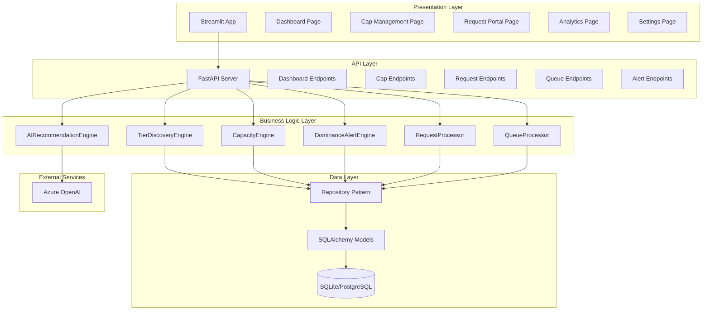
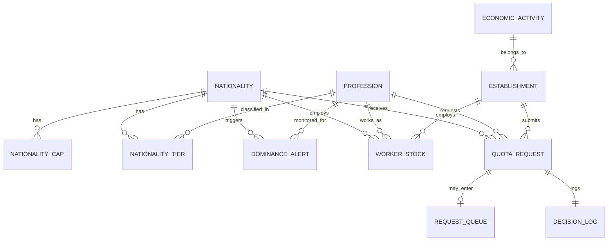

# PLANNING.md - Nationality Quota Allocation System

## Project Overview

**System Name:** Qatar Ministry of Labour - Nationality Quota Allocation System  
**Version:** 2.0 - LMIS Integration  
**Document Date:** 2026-01-13

### Purpose

A dynamic, demand-driven quota allocation system for restricted nationalities in Qatar's private sector. The system manages work permit quotas using intelligent automation while keeping policymakers in control.

### Three Core Principles

1. **Policy-Maker Controlled Caps:** The system provides historical data, demand patterns, and cap recommendations. Policymakers set the final cap for each nationality. Once set, the system manages all allocation dynamically.

2. **Demand-Driven Tier Discovery:** The system analyzes historical request patterns per nationality to discover which professions are in high demand. Professions are automatically classified into tiers (Primary, Secondary, Minor, Unusual) based on their share of requests.

3. **Dynamic Capacity Protection:** High-demand professions (Tier 1) are protected first. Lower tiers only open when projected headroom exceeds Tier 1 demand. The system continuously recalculates based on real-time inflow/outflow.

### Key Innovation

**Auto-Queue Feature:** When a tier is closed, requests can be queued and automatically processed when capacity opens - triggered by workforce outflow, cap adjustments, or demand changes.

---

## System Architecture



### Layer Responsibilities

| Layer | Responsibility | Technologies |
|-------|----------------|--------------|
| Presentation | User interface, data visualization | Streamlit, Plotly |
| API | REST endpoints, request validation | FastAPI, Pydantic |
| Business Logic | Core algorithms, decision engine | Python classes |
| Data | Persistence, queries, migrations | SQLAlchemy, SQLite/PostgreSQL |
| External | AI recommendations | Azure OpenAI GPT-4o |

---

## Database Schema

### Entity Relationship Diagram



### Core Entities

| Table | Key Fields | Purpose |
|-------|------------|---------|
| `nationality` | id, code, name, is_restricted, is_gcc, continent | Nationality classification |
| `profession` | id, code, name, high_demand_flag, non_skilled_fast_track | Occupation data |
| `economic_activity` | id, code, name, sector_group, strategic_weight | Sector classification |
| `establishment` | id, name, activity_id, total_approved, total_used | Employer records |

### Quota Management

| Table | Key Fields | Purpose |
|-------|------------|---------|
| `nationality_cap` | id, nationality_id, year, cap_limit, set_by, set_date | Annual caps set by policymakers |
| `nationality_tier` | id, nationality_id, profession_id, tier_level, share_pct, calculated_date | Discovered tier classification |
| `dominance_alert` | id, nationality_id, profession_id, share_pct, velocity, alert_level | Concentration risk alerts |

### Worker Tracking

| Table | Key Fields | Purpose |
|-------|------------|---------|
| `worker_stock` | id, nationality_id, profession_id, establishment_id, state, visa_expiry, employment_end | Worker state tracking |

**Worker States (Enum):**
- `IN_COUNTRY` - Active visa, physically present
- `COMMITTED` - Approved, visa issued, not yet arrived
- `PENDING` - Application submitted, under review
- `QUEUED` - Waiting for tier to open

### Request Processing

| Table | Key Fields | Purpose |
|-------|------------|---------|
| `quota_request` | id, establishment_id, nationality_id, profession_id, requested_count, status, priority_score, submitted_date, decided_date, decision_reason | Quota applications |
| `request_queue` | id, request_id, queue_position, tier_at_submission, queued_date, expiry_date, last_revalidation | Auto-queue entries |
| `decision_log` | id, request_id, decision, tier_status_snapshot, capacity_snapshot, dominance_snapshot, priority_score, rule_chain, parameter_version, override_flag, override_authority | Full audit trail |

### Configuration

| Table | Key Fields | Purpose |
|-------|------------|---------|
| `parameter_registry` | id, parameter_name, value, category, valid_from, valid_to, changed_by | Configurable thresholds |

---

## Project Structure

```
D:/Quota/
├── .env                          # Azure OpenAI credentials
├── .gitignore
├── requirements.txt
├── README.md
├── PLANNING.md                   # This document
├── TASK.md                       # Task tracking
│
├── config/
│   ├── __init__.py
│   └── settings.py               # Environment + parameter registry defaults
│
├── data/
│   ├── quota.db                  # SQLite database
│   └── synthetic/                # Generated test data CSVs
│
├── src/
│   ├── __init__.py
│   ├── models/
│   │   ├── __init__.py
│   │   ├── base.py               # SQLAlchemy base, engine setup
│   │   ├── core.py               # Nationality, Profession, EconomicActivity, Establishment
│   │   ├── quota.py              # NationalityCap, NationalityTier, DominanceAlert
│   │   ├── worker.py             # WorkerStock with state enum
│   │   ├── request.py            # QuotaRequest, RequestQueue, DecisionLog
│   │   └── config.py             # ParameterRegistry
│   │
│   ├── engines/
│   │   ├── __init__.py
│   │   ├── tier_discovery.py     # TierDiscoveryEngine
│   │   ├── capacity.py           # CapacityEngine
│   │   ├── dominance.py          # DominanceAlertEngine
│   │   ├── request_processor.py  # RequestProcessor
│   │   ├── queue_processor.py    # QueueProcessor
│   │   └── ai_engine.py          # AIRecommendationEngine
│   │
│   ├── api/
│   │   ├── __init__.py
│   │   ├── main.py               # FastAPI app initialization
│   │   ├── routes/
│   │   │   ├── __init__.py
│   │   │   ├── dashboard.py
│   │   │   ├── caps.py
│   │   │   ├── requests.py
│   │   │   ├── queue.py
│   │   │   └── alerts.py
│   │   └── schemas/
│   │       ├── __init__.py
│   │       └── models.py         # Pydantic request/response models
│   │
│   └── utils/
│       ├── __init__.py
│       └── helpers.py
│
├── app/
│   ├── streamlit_app.py          # Main entry point
│   ├── .streamlit/
│   │   └── config.toml           # Streamlit Cloud config
│   ├── pages/
│   │   ├── 1_Dashboard.py
│   │   ├── 2_Cap_Management.py
│   │   ├── 3_Request_Portal.py
│   │   ├── 4_Analytics.py
│   │   └── 5_Settings.py
│   └── components/
│       ├── __init__.py
│       ├── charts.py             # Plotly chart builders
│       ├── tables.py             # Styled data tables
│       ├── cards.py              # Metric cards, status cards
│       └── styles.py             # Qatar theme, CSS
│
├── scripts/
│   ├── generate_synthetic_data.py
│   └── init_db.py
│
└── tests/
    ├── __init__.py
    ├── conftest.py               # Pytest fixtures
    ├── unit/
    │   ├── __init__.py
    │   ├── test_tier_discovery.py
    │   ├── test_capacity.py
    │   ├── test_dominance.py
    │   ├── test_request_processor.py
    │   └── test_queue_processor.py
    └── integration/
        ├── __init__.py
        └── test_full_flow.py
```

---

## Key Business Rules

### Tier Classification Thresholds

| Parameter | Default | Range | Description |
|-----------|---------|-------|-------------|
| `TIER_1_THRESHOLD` | 15% | 10-20% | Primary profession (>15% of requests) |
| `TIER_2_THRESHOLD` | 5% | 3-8% | Secondary profession (5-15% of requests) |
| `TIER_3_THRESHOLD` | 1% | 0.5-2% | Minor profession (1-5% of requests) |
| `TIER_HYSTERESIS` | 2% | 1-3% | Prevents tier oscillation |
| `MIN_REQUESTS_FOR_TIER` | 50 | 20-100 | Minimum sample for tier assignment |

### Dominance Alert Thresholds

| Parameter | Default | Range | Action |
|-----------|---------|-------|--------|
| `DOMINANCE_CRITICAL` | 50% | 45-55% | Block new approvals |
| `DOMINANCE_HIGH` | 40% | 35-50% | Partial approve only |
| `DOMINANCE_WATCH` | 30% | 25-40% | Flag for review |
| `VELOCITY_CRITICAL` | 10pp/3yr | 8-15pp | Accelerating dominance trigger |
| `MIN_PROFESSION_SIZE` | 200 | 100-500 | Dominance rules only apply above this |

### Capacity & Queue Parameters

| Parameter | Default | Range | Description |
|-----------|---------|-------|-------------|
| `PROJECTION_HORIZON_DAYS` | 180 | 90-180 | Rolling forecast window (6 months) |
| `OUTFLOW_CONFIDENCE_FACTOR` | 0.75 | 0.6-0.9 | Conservative buffer on projections |
| `PENDING_APPROVAL_RATE` | 0.8 | 0.7-0.9 | Assumed approval rate for pending |
| `QUEUE_EXPIRY_DAYS` | 90 | 60-120 | Request expires if not processed |
| `QUEUE_CONFIRM_DAYS` | 30 | 20-45 | Applicant must confirm interest |
| `RECALC_FREQUENCY_MINS` | 15 | 5-60 | Tier status recalculation interval |

### Core Formulas

**Effective Headroom Calculation:**
```python
effective_headroom = cap - stock - committed - (pending * 0.8) + (adjusted_outflow * 0.75)
```

**Outflow Projection:**
```python
# Outflow = FINAL EXITS ONLY (not vacation travel)
scheduled_exits = FINAL_EXIT_VISAS + (EXPIRING_CONTRACTS * NON_RENEWAL_RATIO)
projected_outflow = scheduled_exits * CONFIDENCE_FACTOR  # 0.75
```

**Tier Status Determination:**
```python
tier1_status = 'OPEN' if headroom >= tier1_demand else 'RATIONED' if headroom > 0 else 'CLOSED'
tier2_surplus = headroom - tier1_demand
tier2_status = 'OPEN' if tier2_surplus >= tier2_demand else 'LIMITED' if tier2_surplus > 0 else 'CLOSED'
```

### Priority Scoring (Deterministic)

| Factor | Score | Source |
|--------|-------|--------|
| HIGH_DEMAND_SKILL_FLAG = 1 | +50 points | PROFESSION table |
| Strategic Sector (Health, IT, Education) | +30 points | ECONOMIC_ACTIVITY |
| Establishment Utilization >90% | +20 points | Establishment record |
| Establishment Utilization 70-90% | +10 points | Establishment record |
| Establishment Utilization <30% | -20 points | Establishment record |
| Small Establishment (<50 workers) | +10 points | Establishment size |
| Submission Timestamp | Tie-breaker | Application date |

---

## Implementation Phases

| Phase | Description | Estimated Time | Deliverables |
|-------|-------------|----------------|--------------|
| **1** | Environment Setup | 30 min | .gitignore, requirements.txt, config/settings.py, README.md |
| **2** | Data Layer & Synthetic Data | 2 hours | SQLAlchemy models, 150K+ worker records, realistic patterns |
| **3** | Business Logic Engines | 3 hours | 6 engines with unit tests |
| **4** | FastAPI REST Endpoints | 1.5 hours | All API routes with Pydantic schemas |
| **5** | Streamlit Frontend | 3 hours | 5 pages with Qatar theme |
| **6** | Testing | 1.5 hours | Integration tests, edge cases, E2E scenarios |
| **7** | Deployment & Documentation | 1 hour | Streamlit Cloud config, full docs |

**Total Estimated: 12-13 hours**

---

## Git Strategy

### Branches
- `main` - Production-ready code
- `develop` - Integration branch
- `feature/phase-X-name` - Feature branches per phase

### Commit Convention
- `chore:` - Setup/config changes
- `feat:` - New features
- `fix:` - Bug fixes
- `test:` - Test additions
- `docs:` - Documentation

---

## Tech Stack Summary

| Component | Technology | Version |
|-----------|------------|---------|
| Language | Python | 3.11+ |
| Backend Framework | FastAPI | Latest |
| Frontend Framework | Streamlit | Latest |
| ORM | SQLAlchemy | 2.0+ |
| Database (Dev) | SQLite | 3.x |
| Database (Prod) | PostgreSQL | 15+ |
| AI Service | Azure OpenAI | GPT-4o |
| Charts | Plotly | Latest |
| Validation | Pydantic | 2.0+ |
| Testing | Pytest | Latest |

---

## Success Criteria

1. **Dashboard loads instantly** with real-time nationality status
2. **Live eligibility check** during request form submission
3. **AI-powered cap recommendations** with clear rationale
4. **Auto-queue processes automatically** when capacity opens
5. **All decisions logged** with full audit trail for compliance
6. **Professional UI** suitable for government ministry stakeholders
7. **All tests passing** (unit + integration)
8. **Deployable to Streamlit Cloud** with proper secrets management

---

## Constraints & Assumptions

### Constraints
- Max 500 lines per file (per user rules)
- Must use Pydantic for all data validation
- Google-style docstrings required
- Tests required for all new features

### Assumptions
- Azure OpenAI credentials provided in `.env`
- SQLite sufficient for demo; PostgreSQL for production
- Single-tenant deployment (one ministry instance)
- English-only interface initially

---

## References

- Technical Specification: `docs/Nationality_Quota_Formula_v2.docx`
- Implementation Guide: `.cursor/Cursor_Prompt_Quota_System.md`
- Quick Start: `.cursor/Cursor_Quick_Start_Prompt.md`
